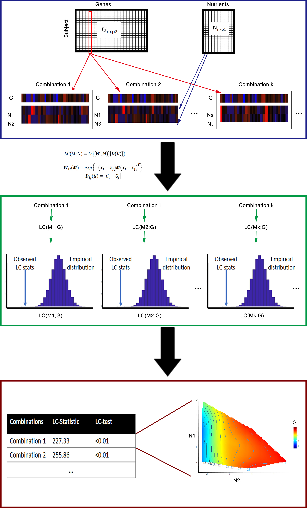

# LC-N2G


Shiny app(LC-N2G) explores the relationship between nutrition and its corresponding gene expression data. The default dataset comes from the mouse nutrition study (GSE85998)[1]. The overall workflow of LC-N2G is as follows and for a full description, we refer to [our paper](Our-paper).

## Installation

### Packages Requirements

- shiny ≥ 1.4.0.2
- shinythemes ≥ 1.1.2
- shinyjs ≥ 1.1
- DT ≥ 0.13
- directlabels ≥ 2020.1.31
- mclust ≥ 5.4.5
- GA ≥ 3.2
- WGCNA ≥ 1.69
- tidyverse ≥ 1.3.0
- plotly ≥ 4.9.2
- visNetwork ≥ 2.0.9
- limma ≥ 3.42.2
- dynamicTreeCut ≥ 1.63-1
- psych ≥ 1.9.12.31
- fields ≥ 10.3
- plotly ≥ 4.9.2
- reshape2 ≥ 1.4.3

### Get started

To use this shiny app you can either:

 - visit our webpage http://shiny.maths.usyd.edu.au/LC-N2G/ , or
 
 - install it through
 
	``` r
	remotes::install_github("SydneyBioX/LCN2G")
	library(LCN2G)
	run_App()
	```
## Vignette

You can find the vignette at our website: https://sydneybiox.github.io/CiteFuse/articles/CiteFuse.html.


## CiteFuse overview



